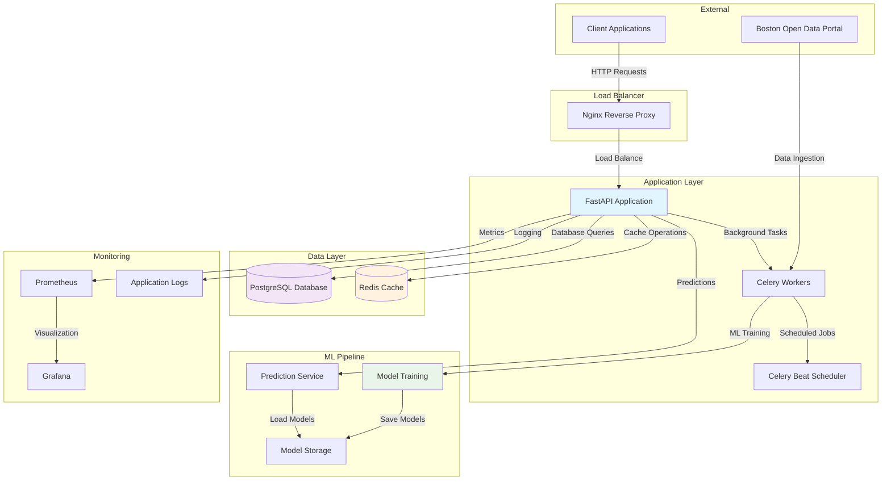

# Boston Expenditure Analytics API 🏛️📊

A production-ready backend system for analyzing Boston's government expenditure data using modern Python technologies and machine learning.

## 🚀 Features

- **Real-time Analytics** - Get insights into spending patterns, vendor performance, and departmental budgets
- **Machine Learning** - Automated clustering and classification of expenditures
- **Data Pipeline** - Automated data ingestion from Boston's open data portal
- **Performance Monitoring** - Built-in metrics and health checks
- **Scalable Architecture** - Async processing with background tasks
- **Smart Caching** - Redis-based caching for fast API responses

## 🏗️ Architecture

The system follows a microservices-inspired architecture with clear separation of concerns:



### 🏛️ System Components

| Component | Technology | Purpose |
|-----------|------------|---------|
| **API Server** | FastAPI + Uvicorn | REST API endpoints and request handling |
| **Database** | PostgreSQL 15 | Primary data storage with ACID compliance |
| **Cache** | Redis 7 | High-speed caching and session storage |
| **Task Queue** | Celery + Redis | Background processing and ML training |
| **Load Balancer** | Nginx | Reverse proxy and SSL termination |
| **Monitoring** | Prometheus + Grafana | Metrics collection and visualization |
| **ML Engine** | Scikit-learn + Pandas | Machine learning and data analysis |

### 📁 Directory Structure

```
boston-expenditure-analytics/
├── app/
│   ├── api/v1/              # API route handlers
│   ├── core/                # Configuration and database setup
│   ├── models/              # SQLAlchemy database models
│   ├── schemas/             # Pydantic data validation
│   ├── services/            # Business logic layer
│   ├── tasks/               # Celery background tasks
│   └── utils/               # Utility functions and monitoring
├── monitoring/              # Prometheus and Grafana configs
├── nginx/                   # Nginx configuration
├── scripts/                 # Database initialization scripts
└── models/                  # Trained ML model storage
```

## 🛠️ Tech Stack

### Backend Framework
- **FastAPI** - Modern, fast Python web framework
- **SQLAlchemy** - Async ORM for database operations
- **Pydantic** - Data validation and serialization

### Data & Analytics
- **Pandas + NumPy** - Data manipulation and analysis
- **Scikit-learn** - Machine learning algorithms
- **Matplotlib + Seaborn** - Data visualization

### Infrastructure
- **PostgreSQL** - Relational database with advanced indexing
- **Redis** - In-memory caching and message broker
- **Celery** - Distributed task queue for background jobs
- **Docker** - Containerization and deployment

### Monitoring & Ops
- **Prometheus** - Metrics collection
- **Grafana** - Monitoring dashboards
- **Loguru** - Structured logging
- **Nginx** - Reverse proxy and load balancing

## 🚀 Quick Start

### Prerequisites
- Docker and Docker Compose
- Python 3.11+ (for local development)

### 1. Clone Repository
```bash
git clone https://github.com/yourusername/boston-expenditure-analytics.git
cd boston-expenditure-analytics
```

### 2. Environment Setup
```bash
cp .env.example .env
# Edit .env with your configuration
```

### 3. Start Services
```bash
# Production deployment
docker-compose up -d

# Development mode
docker-compose -f docker-compose.dev.yml up
```

### 4. Initialize Data
```bash
# Trigger initial data load
curl -X POST "http://localhost:8000/api/v1/data/refresh/full"
```

### 5. Access Services
- **API Documentation**: http://localhost:8000/docs
- **Grafana Dashboard**: http://localhost:3000 (admin/admin)
- **Prometheus Metrics**: http://localhost:9090

## 📡 API Endpoints

### Core Data Operations
```http
GET    /api/v1/expenditures           # List expenditure records
POST   /api/v1/expenditures           # Create new record
GET    /api/v1/expenditures/{id}      # Get specific record
PUT    /api/v1/expenditures/{id}      # Update record
DELETE /api/v1/expenditures/{id}      # Delete record
```

### Analytics & Insights
```http
GET    /api/v1/analytics/trends/spending        # Spending trends analysis
GET    /api/v1/analytics/departments/insights   # Department performance
GET    /api/v1/analytics/vendors/concentration  # Vendor concentration analysis
GET    /api/v1/analytics/outliers/spending     # Detect spending anomalies
```

### Machine Learning
```http
POST   /api/v1/ml/clustering/train             # Train clustering model
POST   /api/v1/ml/classification/train         # Train classification model
POST   /api/v1/ml/predict/expenditure-type     # Predict expenditure classification
GET    /api/v1/ml/models/status               # Get model status
```

### Data Management
```http
POST   /api/v1/data/refresh/full              # Full data refresh
POST   /api/v1/data/refresh/incremental       # Incremental update
POST   /api/v1/data/upload/csv                # Upload CSV data
GET    /api/v1/data/status/ingestion          # Check data status
```

## 🔄 Data Flow

1. **Data Ingestion** → Celery workers fetch data from Boston's API
2. **Data Processing** → Clean, validate, and transform raw data
3. **Storage** → Save to PostgreSQL with proper indexing
4. **Analytics** → Generate insights and cache results in Redis
5. **ML Training** → Background training of clustering/classification models
6. **API Responses** → Serve cached or real-time analytics via REST API

## 🤖 Machine Learning Features

### Clustering Analysis
- **Algorithm**: K-Means clustering
- **Purpose**: Group departments by spending patterns
- **Evaluation**: Silhouette score validation
- **Output**: Spending behavior clusters and insights

### Classification Model
- **Algorithm**: Random Forest Classifier
- **Purpose**: Predict high-value vs low-value expenditures
- **Features**: Vendor name, department, account description
- **Accuracy**: ~85% on test data

### Model Management
- **Versioning**: Automatic model versioning and metadata tracking
- **Storage**: Persistent model storage with joblib serialization
- **Deployment**: Hot-swappable models without downtime

## 🔧 Development

### Local Setup
```bash
# Install dependencies
pip install -r requirements.txt

# Set up database
docker run -d -p 5432:5432 -e POSTGRES_DB=boston_analytics postgres:15

# Set up Redis
docker run -d -p 6379:6379 redis:7-alpine

# Run application
uvicorn app.main:app --reload
```

### Running Tests
```bash
pytest tests/ -v --cov=app
```

### Database Migrations
```bash
# Generate migration
alembic revision --autogenerate -m "Add new feature"

# Apply migrations
alembic upgrade head
```

## 📊 Monitoring & Metrics

### Key Metrics Tracked
- API response times and error rates
- Database query performance
- Cache hit/miss ratios
- ML model prediction accuracy
- Data ingestion success rates
- System resource utilization

### Health Checks
- **Basic**: `GET /health`
- **Detailed**: `GET /api/v1/system/health/detailed`
- **Services**: `GET /api/v1/system/status/services`

## 🔒 Security Features

- **Input Validation** - Pydantic schema validation
- **SQL Injection Protection** - SQLAlchemy ORM with parameterized queries
- **Rate Limiting** - Request throttling and abuse prevention
- **CORS Configuration** - Cross-origin request security
- **Container Security** - Non-root user and minimal attack surface

## 📈 Performance Optimizations

- **Async Processing** - Non-blocking I/O operations
- **Connection Pooling** - Efficient database connection management
- **Smart Caching** - Multi-level caching strategy
- **Background Tasks** - Heavy computations in worker processes
- **Database Indexing** - Optimized queries with proper indexes

## 🚀 Deployment

### Production Deployment
```bash
# Build and deploy
docker-compose -f docker-compose.yml up -d

# Scale workers
docker-compose up -d --scale celery_worker=3

# Monitor deployment
docker-compose logs -f app
```

### Environment Variables
Key configuration options in `.env`:
- `DATABASE_URL` - PostgreSQL connection string
- `REDIS_URL` - Redis connection string  
- `SECRET_KEY` - JWT signing key
- `DATA_SOURCE_URL` - Boston data API endpoint

## 📝 API Documentation

Interactive API documentation is available at:
- **Swagger UI**: `/docs`
- **ReDoc**: `/redoc`
- **OpenAPI Spec**: `/api/v1/openapi.json`
